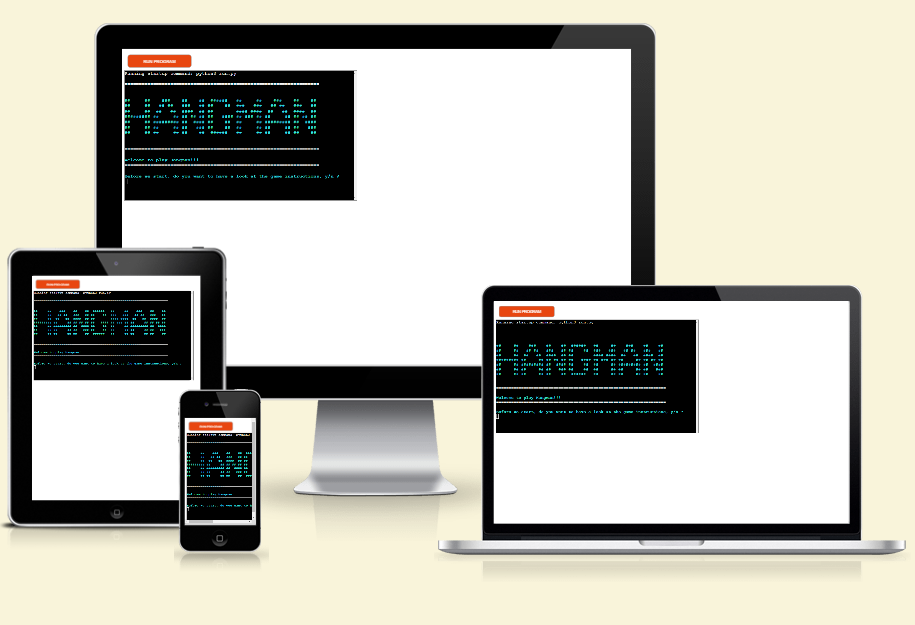

# Hangman

Hangman is a classic wordgame, usually played by two or more players. The game involves guessing letters in a word whose letters are initially completely hidden, but which are shown as clues when the player successfully guesses them.
The secret word is displayed as horizontal bars as the number of letters in the word, and the player have a number of guesses to find the hidden word. If the user guesses a letter that is not in the word, a line is drawn to a figure which, when completed, will represent a hanged lineman, and then the game is over. 
This Hangman game is written in Python and the user plays in a terminal based window. 

### [View the live website here](https://mooller-hangman.herokuapp.com/)

## Structure

In the planning process for the game I made a flowchart to identify the essential steps, and to get a visual view over the required steps and the sequential order. 

### Color scheme

To provide a better user experience, I decided to use colors throughout the game. I wanted to have a general color instead of the white standard text, and decided a lighter blue that gives a good contrast against the black background. If the user input some invalid character or letter, this would be shown with a red text to get the users attention. The user should also pay attention to wrong guesses, if the letter already been used or to see with letters have been previously guessed. To this I decided to use a bright orange. For correct guesses or when the word was revealed a light green color was chosen. To stand ut when the user is out of tries, I choose a bright yellow color.

 - General text, blue (\u001b[1;36m)
 - Error messages, red (\u001b[1;31m)
 - Letter not in word, used letters and previously guessed letters, orange (\033[38;2;255;165;0m)
 - Correct guess or when word is found, green (\u001b[1;92m)
 - User is out of tries, yellow (\u001b[1;93m)

## Features

### Design

### Existing Features

### Future Features

## Testing

## Deployment

## Credits & Content

### Media